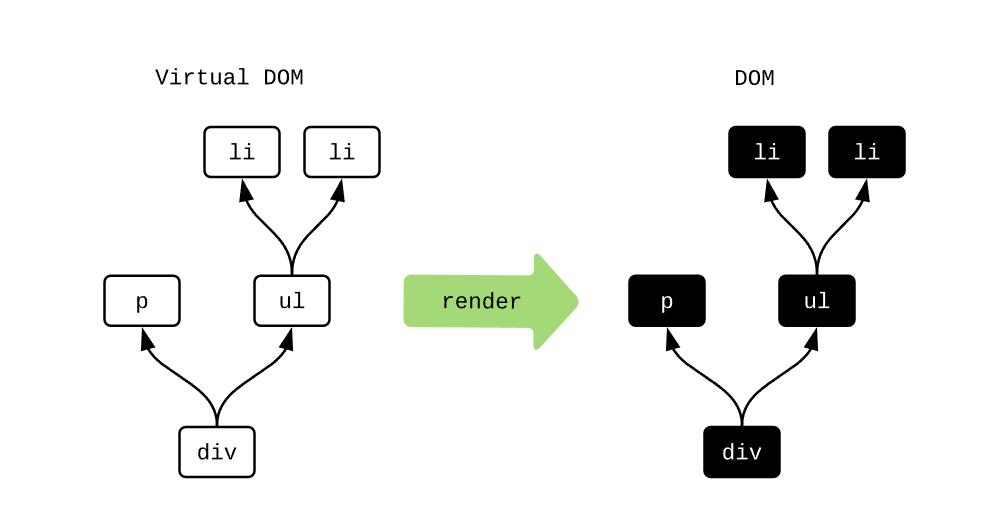

# Elm中的惰性加载的概念

## Virtual Dom

`Elm`中的Virtual Dom是一个虚拟的Dom树，本质上是个JS的对象，里面保存了一些设定的属性。但是对象的创建过程并没有涉及到渲染。这样有效地增加了速度。在触发`init`和`view`时，就会产生一个真实的渲染好的拷贝。



## Diff

`Elm`在更新数据时，虽然整个Model可能很大，但是它只渲染DOM树前后不同的地方：


## `Html.lazy`

`lazy`接收一个可以返回Dom的函数，作用是只在需要时候才被渲染，这样进一步减少了开销。

```elm
lazy : (a -> Html msg) -> a -> Html msg
```

